## Robotics/Path Planning 
### [DRAFT]

This repository contains code I developed to illustrate various robotics and path planning concepts while taking MTE 544 (Autonomous Mobile Robotics) at the University of Waterloo in Winter 2020.

Everything in the repository is my own work.

For all images in this document, I used the occupancy grid map provided in this repo in `sim_map.pgm`. It has a scale of 1px=10cm, with the black areas representing obstacles.

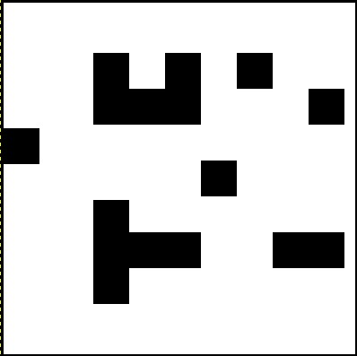

Where robot location/trajectory was simulated, I used the "unicycle" model in which the robot's forward and angular speed can be controlled independently.

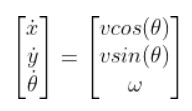

This corresponds well to the [turtlebot](https://www.turtlebot.com/) robots which are well-supported under ROS. For control however, practical limits on performance such as delays and actuator saturation were not modeled or simulated. If required, ROS has an excellent [Turtlebot simulation package](http://wiki.ros.org/turtlebot3_gazebo?distro=melodic).

#### Running the code
Each `.py` (Python 3.5+) file is independent. Numpy and matplotlib are the only requirements. Note that the random number generator uses a fixed seed, this is only to ensure consistency in generating the images used in this document.  

### Potential Fields
This method generates artificial potential fields using map information. The goal is to produce an artificial potential field such that the starting point has the highest potential and the destination has the lowest, with high potentials surrounding any obstacles. Then, using gradient descent, an artificial force vector can be generated at each position, indicating the direction the robot should move. Think of this as analogous to a ball rolling down a hill, it always moves towards the bottom of the hill in the steepest direction.

Two different potential fields are used: the first is simply based on distance to the destination; points further away have higher potential. For this example we use a simple linear field. The second field is generated around obstacles to keep the robot away from them. We use a quadratic field, where the potential is proportional to the distance from the point to an obstacle divided by a distance cutoff, squared. The fields are then summed to produce an overall potential field used to determine the path of the robot. Tuning the weights of each field is required in order to ensure the overall field functions correctly. Sampling is random rather than grid-based in order to avoid issues with grid-aligned obstacles. 

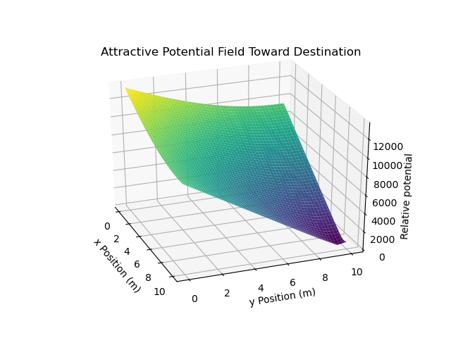
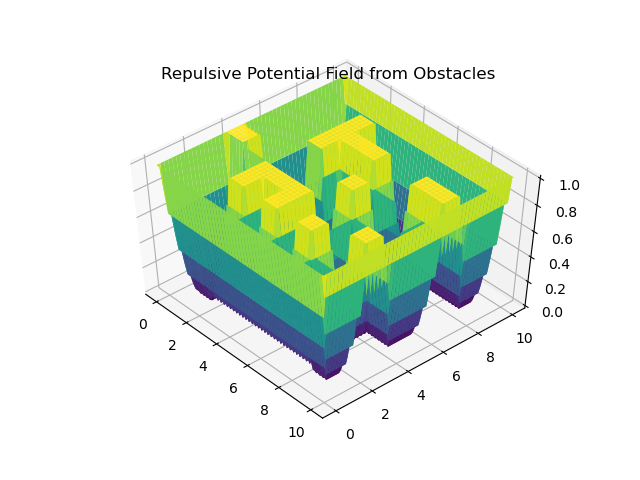
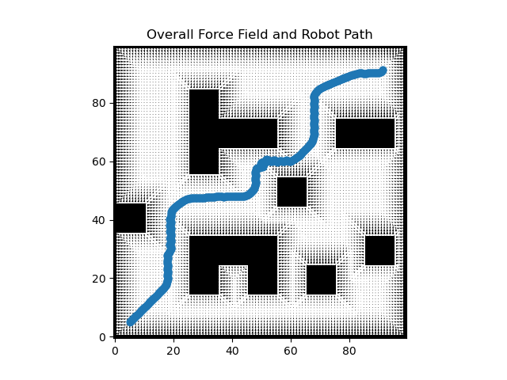

A drawback of potential fields is that in the case on concave obstacles, the robot may be drawn to and stuck in a local minimum. Using potential fields as a local planner only in concert with a global path planner such as PRM or RRTs can help to alleviate this.

#### Resources
- [Motion Planning 3 (Oriolo): Artificial Potential Fields](https://www.dis.uniroma1.it/~oriolo/amr/slides/MotionPlanning3_Slides.pdf`)
- [Robotic Motion Planning (Choset): Potential Functions](https://www.cs.cmu.edu/~motionplanning/lecture/Chap4-Potential-Field_howie.pdf)
- [Local Path Planning Using Virtual Potential Field (Safadi)](https://www.cs.mcgill.ca/~hsafad/robotics/)

### Probabilistic Roadmapping
As the name suggests, PRM is a probabilistic global path-planning method. It works by randomly sampling the map, and only keeping samples in valid robot positions (ie. not within an obstacle or too close to an obstacle). As well, samples that are too close to other samples are discarded (Optional but increases performace). 

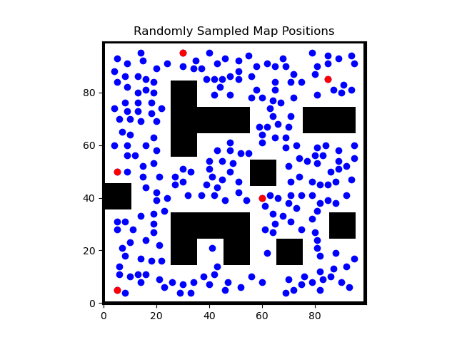

After the map has been adequately sampled (number of samples requires tuning based on map size and percentage of obstacle cover), the samples are used to construct an undirected graph. Samples (points) are connected to every other sample within a tunable radius, as long as the connection/edge does not pass within or too close to an obstacle. 

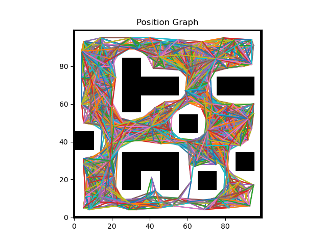

Finally, after the graph has been constructed (assuming it is *connected*), the shortest path between a starting position and an ending position can be found via standard graph traversal algorithms. In this case A* was used , however other algorithms such as BFS, Dijkstra, or Bellman-Ford could be used. 

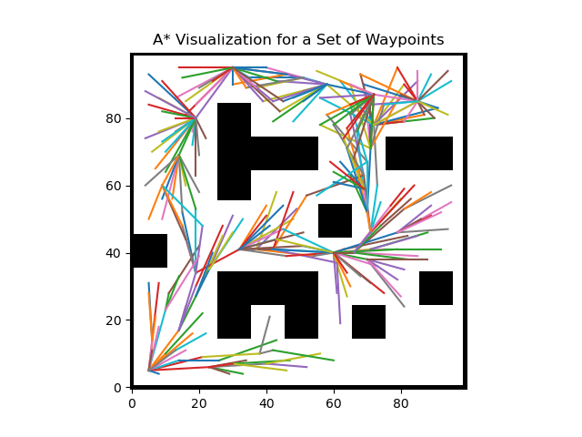
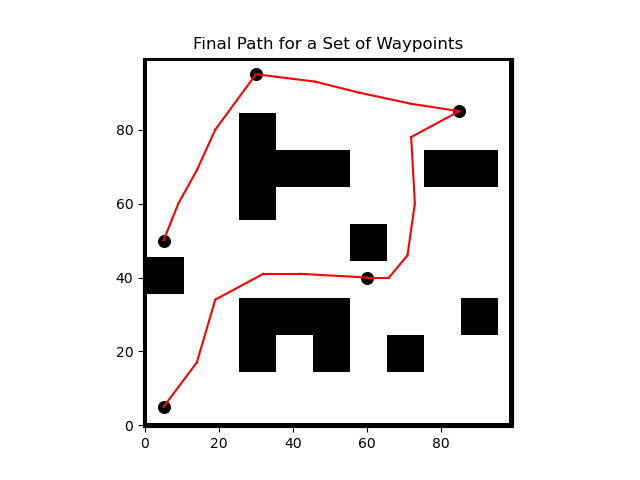

#### Resources
- [Autonomous Mobilie Robotics (Waslander) Section 8: Planning II](http://wavelab.uwaterloo.ca/sharedata/ME597/ME597_Lecture_Slides/ME597-8-PlanningII.pdf)

### Rapidly-Expanding Random Trees
Similar the PRM, the RRT method works by sampling the map, constructing a graph, and using the graph to plan a path. However, the graph generated in this case is directed and hierarchical, ie. a tree. The tree is rooted at the starting position, and terminates when the final position is added as a leaf. To add a new leaf to the tree, a random sample position in the map is generated. The sample is discarded (optional) if it lies to close to another point in the tree, otherwise the nearest neighbor already in the tree is found. The path between the neighbor and the point is traced out, checking for obstacles (or being too close to an obstacle). If the path is completely clear, the sampled point is added to the tree with the nearest neighbor as a parent. If the path is not clear, the closest clear point to the generated point is added instead (as shown below). 

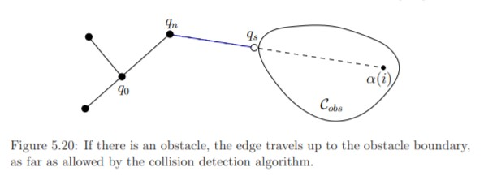
Image from LaValle

Once a leaf node is added to the tree that lies within a threshold distance of the destination (with a clear path between the two), the destination itself is added to the tree. The path from origin to destination can be found by constructing a list of points by following the parent pointers from the destination back up to the origin, then reversing the order of the list.

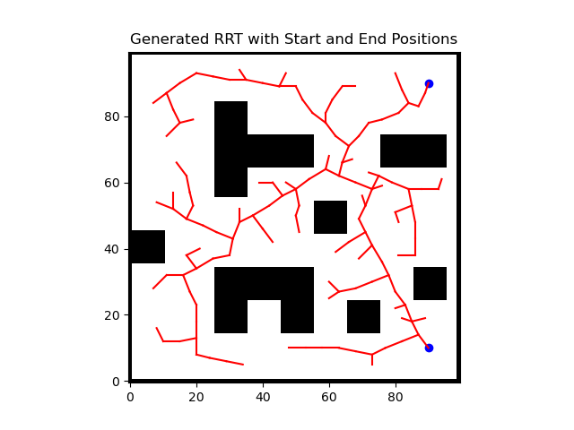

Currently due to the small size of the map nearest-neighbor calculations are performed in a niave manner by checking the distance to all nodes from a new node. In a more resource-constrained environment or with larger maps a more efficient method such as kd-trees should be used for efficient nearest-neighbor search. As well, various other methods such as adding intermediate nodes between points, checking for the nearest edge rather than neighbor, or growing multiple trees could be implimented. LaValle is a good resource to understand different methods.
#### Resources
- ["Planning Algorithms" (LaValle) Chapter 5: Sampling-Based Motion Planning: Rapidly Exploring Dense Trees (5.5)](http://lavalle.pl/planning/ch5.pdf)
- [Robotic Motion Planning:
RRT’s (Choset)](https://www.cs.cmu.edu/~motionplanning/lecture/lec20.pdf)

### Importance Sampling
TODO
#### Resources
- [Autonomous Mobile Robotics (Waslander) Section 7: Estimation II](http://wavelab.uwaterloo.ca/sharedata/ME597/ME597_Lecture_Slides/ME597-5-EstimationII.pdf)

